# Lista de componentes de ColeccionME

Esta lista de componentes está pensada para poder ser usada con los alumnos en el Ciclo Formativo de Grado Superior de Mantenimiento Electrónico. Los componentes están clasificados por su tecnología de la siguiente manera:

1. Puertas Lógicas
2. Constantes
3. Combinacionales
4. Circuitos Secuenciales
5. Periféricos

A cada componente se le ha asignado un nombre, descripción, imagen, autorría y información específica. Hay algunos componentes que son conjuntos de del mismo tipo de componente con pequeños cambios comprimidos en un archivo. Para descargar la colección entera e importarla al IceStudio [pulsar el enlace](../ColeccionME.zip)

### Puertas Lógicas

|            Componente             |                SVG                 |            Autor            |     Info      |
| :-------------------------------: | :--------------------------------: | :-------------------------: | :-----------: |
|  [AND](blocks/1-Puertas/and.ice)  |   | Jesús Arroyo, Juan González | Versión 1.0.1 |
|   [OR](blocks/1-Puertas/or.ice)   |    | Jesús Arroyo, Juan González | Versión 1.0.1 |
|  [NOT](blocks/1-Puertas/not.ice)  |   | Jesús Arroyo, Juan González | Versión 1.0.3 |
| [NAND](blocks/1-Puertas/nand.ice) |  | Jesús Arroyo, Juan González | Versión 1.0.1 |
|  [NOR](blocks/1-Puertas/nor.ice)  |   | Jesús Arroyo, Juan González | Versión 1.0.1 |
|  [XOR](blocks/1-Puertas/xor.ice)  |   | Jesús Arroyo, Juan González | Versión 1.0.1 |
| [XNOR](blocks/1-Puertas/xnor.ice) |  | Jesús Arroyo, Juan González | Versión 1.0.1 |

### Circuitos Combinacionales y Aritméticos

|                          Componente                          |                         Descripción                          |                            SVG                             |     Autor      |     Info      |
| :----------------------------------------------------------: | :----------------------------------------------------------: | :--------------------------------------------------------: | :------------: | :-----------: |
| [cod-02-1](blocks/3-Combinacionales/1-Codificadores/cod-02-1.ice) | Codificador de 2 a 1 (Decimal a Binario) con prioridad. La salida zero se activa cuando ninguna entrada está activada |           | Juan González  |  Versión 0.1  |
| [cod-04-2](blocks/3-Combinacionales/1-Codificadores/cod-04-2.ice) | Codificador de 4 a 2 (Decimal a Binario) con prioridad. La salida zero se activa cuando ninguna entrada está activada |           | Juan González  |  Versión 0.1  |
| [cod-04-2-bus](blocks/3-Combinacionales/1-Codificadores/cod-04-2-bus.ice) | Codificador de 4 a 2 (Decimal a Binario), con prioridad. La salida zero se activa cuando ninguna entrada está activad. Entradas y salidas de buses |           | Juan González  |  Versión 0.1  |
| [cod-08-3-bus](blocks/3-Combinacionales/1-Codificadores/cod-08-3-bus.ice) | Codificador de 8 a 3 (Decimal a Binario), con prioridad. La salida zero se activa cuando ninguna entrada está activad. Entradas y salidas de buses |           | Juan González  |  Versión 0.1  |
| [cod-16-4-bus](blocks/3-Combinacionales/1-Codificadores/cod-16-4-bus.ice) | Codificador de 16 a 4 (Decimal a Binario), con prioridad. La salida zero se activa cuando ninguna entrada está activad. Entradas y salidas de buses |           | Ion Hernandez  |  Versión 0.1  |
| [decod-1-02](blocks/3-Combinacionales/2-Decodific/decod-1-02.ice) | Decodificador de 1 a 2 (Binario a Decimal) de lógica positiva |           | Juan González  |  Versión 0.1  |
| [decod-2-04](blocks/3-Combinacionales/2-Decodific/decod-2-04.ice) | Decodificador de 2 a 4 (Binario a Decimal) de lógica positiva |           | Juan González  |  Versión 0.1  |
| [decod-2-04-bus](blocks/3-Combinacionales/2-Decodific/decod-2-04-bus.ice) | Decodificador de 2 a 4 (Binario a Decimal) de lógica positiva, con salida en bus |           | Juan González  |  Versión 0.1  |
| [decod-3-08](blocks/3-Combinacionales/2-Decodific/decod-3-08.ice) | Decodificador de 3 a 8 (Binario a Decimal) de lógica positiva |           | Juan González  |  Versión 0.1  |
| [decod-3-08-bus](blocks/3-Combinacionales/2-Decodific/decod-3-08-bus.ice) | Decodificador de 3 a 8 (Binario a Decimal) de lógica positiva, con salida en bus |           | Ion Hernandez  |  Versión 0.1  |
| [decod-4-16-bus](blocks/3-Combinacionales/2-Decodific/decod-4-16-bus.ice) | Decodificador de 4 a 16 (Binario a Decimal) de lógica positiva, con salida en bus |           | Ion Hernandez  |  Versión 0.1  |
| [displayBit-AC](blocks/3-Combinacionales/2-Decodific/7Seg/Anodo-comun/displayBit-AC.ice) |      Decodificador de 1 bit a 7 segmentos. Ánodo común       |          | Juan González  |  Versión 0.1  |
| [displayBit2-AC](blocks/3-Combinacionales/2-Decodific/7Seg/Anodo-comun/displayBit2-AC.ice) |      Decodificador de 2 bits a 7 segmentos. Ánodo común      |          | Juan González  |  Versión 0.1  |
| [displayBit3-AC](blocks/3-Combinacionales/2-Decodific/7Seg/Anodo-comun/displayBit3-AC.ice) |      Decodificador de 3 bits a 7 segmentos. Ánodo común      |          | Juan González  |  Versión 0.1  |
| [displayDEC-AC](blocks/3-Combinacionales/2-Decodific/7Seg/Anodo-comun/displayDEC-AC.ice) |         Decodificador BCD a 7 segmentos. Ánodo común         |          | Juan González  |  Versión 0.1  |
| [displayHEX-AC](blocks/3-Combinacionales/2-Decodific/7Seg/Anodo-comun/displayHEX-AC.ice) | Decodificador de binario a hexadecimal-7 segmentos. Ánodo común |   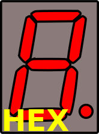   | Juan González  |  Versión 0.1  |
| [displayBit-CC](blocks/3-Combinacionales/2-Decodific/7Seg/Catodo-comun/displayBit-CC.ice) |      Decodificador de 1 bit a 7 segmentos. Cátodo común      |          | Juan González  |  Versión 0.1  |
| [displayBit2-CC](blocks/3-Combinacionales/2-Decodific/7Seg/Catodo-comun/displayBit2-CC.ice) |     Decodificador de 2 bits a 7 segmentos. Cátodo común      |          | Juan González  |  Versión 0.1  |
| [displayBit3-CC](blocks/3-Combinacionales/2-Decodific/7Seg/Catodo-comun/displayBit3-CC.ice) |     Decodificador de 3 bits a 7 segmentos. Cátodo común      |          | Juan González  |  Versión 0.1  |
| [displayDEC-CC](blocks/3-Combinacionales/2-Decodific/7Seg/Catodo-comun/displayDEC-CC.ice) |        Decodificador BCD a 7 segmentos. Cánodo común         |          | Juan González  |  Versión 0.1  |
| [displayHEX-CC](blocks/3-Combinacionales/2-Decodific/7Seg/Catodo-comun/displayHEX-CC.ice) | Decodificador de binario a hexadecimal-7 segmentos. Cátodo común |      | Juan González  |  Versión 0.1  |
| [BCD-ASCII](blocks/3-Combinacionales/2-Decodific/7Seg/Catodo-comun/BCD-ASCII.ice) |                  Decodificador BCD a ASCII                   |             | Juan González  |  Versión 0.1  |
| [Mux-2-1](blocks/3-Combinacionales/3-Multiplex/Mux-01-Bit/Mux-2-1.ice) |  Multiplexador de un bit de 2 canales de entrada a 1 salida  |               | Juan González  | Versión 0.0.1 |
| [Mux-4-1](blocks/3-Combinacionales/3-Multiplex/Mux-01-Bit/Mux-4-1.ice) |  Multiplexador de un bit de 4 canales de entrada a 1 salida  |               | Juan González  | Versión 0.0.1 |
| [Mux-2-1-4Bits](blocks/3-Combinacionales/3-Multiplex/Mux-04-Bit/Mux-2-1.ice) | Multiplexador de 2 canales de entrada a 1 salida. Cada canal de entrada y salida tiene 4 bits |               | Juan González  | Versión 0.0.1 |
| [Mux-4-1-4Bits](blocks/3-Combinacionales/3-Multiplex/Mux-04-Bit/Mux-4-1.ice) | Multiplexador de 4 canales de entrada a 1 salida. Cada canal de entrada y salida tiene 4 bits |               | Juan González  | Versión 0.0.1 |
| [Mux-2-1-8Bits](blocks/3-Combinacionales/3-Multiplex/Mux-08-Bit/Mux-2-1.ice) | Multiplexador de 2 canales de entrada a 1 salida. Cada canal de entrada y salida tiene 8 bits |               | Juan González  | Versión 0.0.1 |
| [Mux-4-1-8Bits](blocks/3-Combinacionales/3-Multiplex/Mux-08-Bit/Mux-4-1.ice) | Multiplexador de 4 canales de entrada a 1 salida. Cada canal de entrada y salida tiene 8 bits |               | Juan González  | Versión 0.0.1 |
| [Mux-2-1-24Bits](blocks/3-Combinacionales/3-Multiplex/Mux-24-Bit/Mux-2-1.ice) | Multiplexador de 2 canales de entrada a 1 salida. Cada canal de entrada y salida tiene 24 bits |               | Juan González  | Versión 0.0.1 |
| [Demux-1-2](blocks/3-Combinacionales/4-Demultiplex/1-Bit/Demux-1-2.ice) | Demultiplexador de un bit de 1 entrada a 2 canales de salida |               | Juan González  |  Versión 0.1  |
| [Demux-1-4](blocks/3-Combinacionales/4-Demultiplex/1-Bit/Demux-2-4.ice) | Demultiplexador de un bit de 1 entrada a 4 canales de salida |               | Juan González  |  Versión 0.1  |
| [Igual-1-op](blocks/3-Combinacionales/5-Comparadores/Comp-01-Bit/Igual-1-op.ice) | Comparador de igualdad de 1 operando de 1 bit, respecto a una constante predefinida 0 |      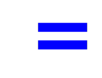      | Juan González  |  Versión 0.1  |
| [Igual-2-op](blocks/3-Combinacionales/5-Comparadores/Comp-01-Bit/Igual-2-op.ice) |      Comparador de igualdad de 2 operandos de un 1 bit       |            | Juan González  |  Versión 0.1  |
| [Menor-1-op](blocks/3-Combinacionales/5-Comparadores/Comp-01-Bit/Menor-1-op.ice) | Comparador menor que, de 1 operando de 1 bit, respecto a una constante predefinida 0 |            | Juan González  |  Versión 0.1  |
| [Menor-2-op](blocks/3-Combinacionales/5-Comparadores/Comp-01-Bit/Menor-2-op.ice) |        Comparador menor que, de 2 operandos de 1 bit         |            | Juan González  |  Versión 0.1  |
| [Comp-2-op><=](blocks/3-Combinacionales/5-Comparadores/Comp-01-Bit/Comp-MayorMenorIgual.ice) | Comparador de igualdad, mayor o menor de 2 operandos de 1 bit | 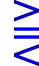 | Ion Hernandez  |  Versión 0.1  |
| [Igual-1-op-2Bits](blocks/3-Combinacionales/5-Comparadores/Comp-02-Bit/Igual-1-op.ice) | Comparador de igualdad de 1 operando de 2 bits, respecto a una constante predefinida 0 |            | Juan González  |  Versión 0.1  |
| [Igual-2-op-2Bits](blocks/3-Combinacionales/5-Comparadores/Comp-02-Bit/Igual-2-op.ice) |      Comparador de igualdad de 2 operandos de un 2 bits      |            | Juan González  |  Versión 0.1  |
| [Menor-1-op-2Bits](blocks/3-Combinacionales/5-Comparadores/Comp-02-Bit/Menor-1-op.ice) | Comparador menor que, de 1 operando de 2 bits, respecto a una constante predefinida 0 |            | Juan González  |  Versión 0.1  |
| [Menor-2-op-2Bits](blocks/3-Combinacionales/5-Comparadores/Comp-02-Bit/Menor-2-op.ice) |        Comparador menor que, de 2 operandos de 2 bits        |            | Juan González  |  Versión 0.1  |
| [Comp-2-op><=2Bits](blocks/3-Combinacionales/5-Comparadores/Comp-02-Bit/Comp-MayorMenorIgual.ice) | Comparador de igualdad, mayor o menor de 2 operandos de 2 bits |  | Ion Hernandez  |  Versión 0.1  |
| [Igual-1-op-3Bits](blocks/3-Combinacionales/5-Comparadores/Comp-03-Bit/Igual-1-op.ice) | Comparador de igualdad de 1 operando de 3 bits, respecto a una constante predefinida 0 |            | Juan González  |  Versión 0.1  |
| [Igual-2-op-3Bits](blocks/3-Combinacionales/5-Comparadores/Comp-03-Bit/Igual-2-op.ice) |      Comparador de igualdad de 2 operandos de un 3 bits      |            | Juan González  |  Versión 0.1  |
| [Menor-1-op-3Bits](blocks/3-Combinacionales/5-Comparadores/Comp-03-Bit/Menor-1-op.ice) | Comparador menor que, de 1 operando de 3 bits, respecto a una constante predefinida 0 |            | Juan González  |  Versión 0.1  |
| [Menor-2-op-3Bits](blocks/3-Combinacionales/5-Comparadores/Comp-03-Bit/Menor-2-op.ice) |        Comparador menor que, de 2 operandos de 3 bits        |            | Juan González  |  Versión 0.1  |
| [Comp-2-op><=3Bits](blocks/3-Combinacionales/5-Comparadores/Comp-03-Bit/Comp-MayorMenorIgual.ice) | Comparador de igualdad, mayor o menor de 2 operandos de 3 bits |  | Ion Hernandez  |  Versión 0.1  |
| [Igual-1-op-4Bits](blocks/3-Combinacionales/5-Comparadores/Comp-04-Bit/Igual-1-op.ice) | Comparador de igualdad de 1 operando de 4 bits, respecto a una constante predefinida 0 |            | Juan González  |  Versión 0.1  |
| [Igual-2-op-4Bits](blocks/3-Combinacionales/5-Comparadores/Comp-04-Bit/Igual-2-op.ice) |      Comparador de igualdad de 2 operandos de un 4 bits      |            | Juan González  |  Versión 0.1  |
| [Menor-1-op-4Bits](blocks/3-Combinacionales/5-Comparadores/Comp-04-Bit/Menor-1-op.ice) | Comparador menor que, de 1 operando de 4 bits, respecto a una constante predefinida 0 |            | Juan González  |  Versión 0.1  |
| [Menor-2-op-4Bits](blocks/3-Combinacionales/5-Comparadores/Comp-04-Bit/Menor-2-op.ice) |        Comparador menor que, de 2 operandos de 4 bits        |            | Juan González  |  Versión 0.1  |
| [Comp-2-op><=4Bits](blocks/3-Combinacionales/5-Comparadores/Comp-04-Bit/Comp-MayorMenorIgual.ice) | Comparador de igualdad, mayor o menor de 2 operandos de 4 bits |  | Ion Hernandez  |  Versión 0.1  |
| [Igual-1-op-8Bits](blocks/3-Combinacionales/5-Comparadores/Comp-08-Bit/Igual-1-op.ice) | Comparador de igualdad de 1 operando de 8 bits, respecto a una constante predefinida 0 |            | Juan González  |  Versión 0.1  |
| [Igual-2-op-8Bits](blocks/3-Combinacionales/5-Comparadores/Comp-08-Bit/Igual-2-op.ice) |      Comparador de igualdad de 2 operandos de un 8 bits      |            | Juan González  |  Versión 0.1  |
| [Menor-1-op-8Bits](blocks/3-Combinacionales/5-Comparadores/Comp-08-Bit/Menor-1-op.ice) | Comparador menor que, de 1 operando de 8 bits, respecto a una constante predefinida 0 |            | Juan González  |  Versión 0.1  |
| [Menor-2-op-8Bits](blocks/3-Combinacionales/5-Comparadores/Comp-08-Bit/Menor-2-op.ice) |        Comparador menor que, de 2 operandos de 8 bits        |            | Juan González  |  Versión 0.1  |
| [Comp-2-op><=8Bits](blocks/3-Combinacionales/5-Comparadores/Comp-08-Bit/Comp-MayorMenorIgual.ice) | Comparador de igualdad, mayor o menor de 2 operandos de 8 bits |  | Ion Hernandez  |  Versión 0.1  |
| [mi-tablaX-X](blocks/3-Combinacionales/6-TablasEstados/6-TablasEstados.zip) | Conjunto de tablas (64 en total) preparadas para configurar una función lógica combinacional (tabla de la verdad). Están clasificadas por el número de entradas (1-8) y por el número de salidas (1-8) |             | IceFactory 0.1 |  Versión 0.1  |
| [Agregador-2Bits](blocks/3-Combinacionales/7-AgregaSepara/02_bits/Agregador.ice) |          Agregador de 2 cables en un bus de 2-bits           |      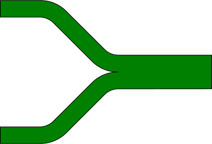       | Juan González  |  Versión 0.1  |
| [Separadores- 2Bits](blocks/3-Combinacionales/7-AgregaSepara/02_bits/Separador.ice) |            Separador de bus de 2-bits en 2 cables            |             | Juan González  |  Versión 0.1  |
| [Agregador-3Bits](blocks/3-Combinacionales/7-AgregaSepara/03_bits/Agregador.ice) |          Agregador de 3 cables en un bus de 3-bits           |             | Juan González  |  Versión 0.1  |
| [Separador-3Bits](blocks/3-Combinacionales/7-AgregaSepara/03_bits/Separador.ice) |            Separador de bus de 3-bits en 3 cables            |             | Juan González  |  Versión 0.1  |
| [Acoplador-3-8](blocks/3-Combinacionales/7-AgregaSepara/03_bits/Acoplador-3-8.ice) |   Acoplador de buses de 3 a 8 bits. Se rellena con 5 ceros   |             | Juan González  |  Versión 0.1  |
| [Agregador-2-4Bits](blocks/3-Combinacionales/7-AgregaSepara/03_bits/Agregador) |         Agregador de buses de 2-bits a bus de 4-bits         |             | Juan González  |  Versión 0.1  |
| [Agregador-4Bits](blocks/3-Combinacionales/7-AgregaSepara/03_bits/Agregador4.ice) |          Agregador de 4 cables en un bus de 4-bits           |             | Juan González  |  Versión 0.1  |
| [Separador-2-4Bits](blocks/3-Combinacionales/7-AgregaSepara/03_bits/Separador.ice) |        Separador de bus de 4-bits en buses de 2 bits         |             | Juan González  |  Versión 0.1  |
| [Separador-4Bits](blocks/3-Combinacionales/7-AgregaSepara/03_bits/Separador4.ice) |            Separador de bus de 4-bits en 4 cables            |             | Juan González  |  Versión 0.1  |
| [Agregador-8Bits](blocks/3-Combinacionales/7-AgregaSepara/03_bits/Agregador.ice) |        Agregador de 2 buses de 4-bits a bus de 8-bits        |             | Juan González  |  Versión 0.1  |
| [Separador-8Bits](blocks/3-Combinacionales/7-AgregaSepara/03_bits/Separador.ice) |        Separador de bus de 8-bits en buses de 4 bits         |             | Juan González  |  Versión 0.1  |

### Circuitos Secuenciales

|                          Componente                          |                         Descripción                          |                         SVG                          |     Autor     |     Info      |
| :----------------------------------------------------------: | :----------------------------------------------------------: | :--------------------------------------------------: | :-----------: | :-----------: |
| [timer-sec](blocks/4-Secuenciales/1-Multivib/1-Monoestables/1-Timers/1-timer-sec.ice) | Temporizador en segundos. La señal p está activa durante el tiempo indicado. Por tic se emite un tic al finalizar |          | Juan González |  Versión 0.1  |
| [timer-msec](blocks/4-Secuenciales/1-Multivibr/1-Monoestables/1-Timers/2-timer-msec.ice) | Temporizador en milisegundos. La señal p está activa durante el tiempo indicado. Por tic se emite un tic al finalizar |    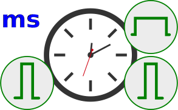     | Juan González |  Versión 0.1  |
| [timer-usec](blocks/4-Secuenciales/1-Multivibr/1-Monoestables/1-Timers/3-timer-usec.ice) | Temporizador en microsegundos. La señal p está activa durante el tiempo indicado. Por tic se emite un tic al finalizar |         | Juan González |  Versión 0.1  |
| [timer-usec](blocks/4-Secuenciales/1-Multivibr/1-Monoestables/1-Timers/4-timer-system.ice) | Temporizador en tics. La señal p está activa durante los tics indicados. ov se emite un tic al finalizar |       | Juan González |  Versión 0.1  |
| [Antirrebote](blocks/4-Secuenciales/1-Multivibr/1-Monoestables/3-Antirrebote.ice) |        Quita el rebote de los interruptores mecánicos        |        | Juan González | Versión 1.0.0 |
| [Bajada](blocks/4-Secuenciales/1-Multivibr/1-Monoestables/2-Flancos-Tics/Bajada.ice) | Detector de flanco de bajada. Emite un tic cuando detecta un flanco descendente |             | Juan González |  Versión 0.1  |
| [Subida](blocks/4-Secuenciales/1-Multivibr/1-Monoestables/2-Flancos-Tics/Subida.ice) | Detector de flanco de subida. Emite un tic cuando detecta un flanco ascendente |             | Juan González |  Versión 0.1  |
| [Pulsador-tic](blocks/4-Secuenciales/1-Multivibr/1-Monoestables/4-Pulsador-tic.ice) | Detección de pulsaciónes mecánicas. Emite un tic cada vez que se aprieta el pulsador |   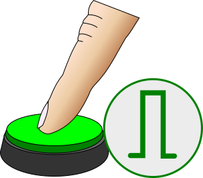    | Juan González |  Versión 0.1  |
| [Sync](blocks/4-Secuenciales/1-Multivibr/1-Monoestables/5-Sync.ice) |  Sincronizar las entradas de datos con el reloj del sistema  |               | Juan González |  Versión 0.1  |
| [Set-Reset](blocks/4-Secuenciales/3-Secuenciales/1-Multivibr/2-Biestables/1-Set-Reset.ice) | Biestable con entradas de Set y Reset síncronas, para poner y quitar notaficaciones de eventos |          | Juan González |  Versión 0.1  |
| [Dato](blocks/4-Secuenciales/1-Multivibr/2-Biestables/2-Dato.ice) | Biestable de datos (Tipo D). Cuando se recibe un tic por load se captura el dato |               | Juan González |  Versión 0.1  |
| [T-Cambio](blocks/4-Secuenciales/1-Multivibr/2-Biestables/3-T-Cambio.ice) | Biestable de cambio (Tipo T). Cuando se recibe un tic cambia de estado |           | Juan González |  Versión 0.1  |
| [T-Cambio-Pulsador](blocks/4-Secuenciales/1-Multivibr/2-Biestables/4-T-Cambio-Pulsador.ice) | Pulsador de cambio. Cada vez que se aprieta cambia de estado |  | Juan González |  Versión 0.1  |
| [T-Cambio-Once](blocks/4-Secuenciales/1-Multivibr/2-Biestables/5-T-Cambio-Once.ice) | Biestable de cambio. Cambia cuando recibe un tic, cuando vuelva a su estado de reposo (0) nunca más lo hará |      | Juan González |  Versión 0.1  |
| [Corazon_Seg](blocks/4-Secuenciales/3-Astables/Corazon_Seg.ice) | Corazon genérico para bombear pulsos con un periodo fijo (por defecto 1 segundo) |        | Juan González |  Versión 0.1  |
| [Corazon_Hz](blocks/4-Secuenciales/3-Astables/Corazon_Hz.ice) | Corazon genérico para bombear pulsos a la frecuencia fijada en Hz (por defecto 1Hz) |         | Juan González |  Versión 0.1  |
| [Corazon_DO4](blocks/4-Secuenciales/3-Astables/Corazon_DO4.ice) | Bombear bits a la frecuencia de la nota DO de la cuarta octava |        | Juan González |  Versión 0.1  |
| [Corazon-tic-Hz](blocks/4-Secuenciales/3-Astables/Tics/01-Heart-Hz.ice) | Corazón de bombeo de tics con una frecuencia parametrica en Hz (por defecto 1 Hz) |  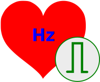   | Juan González |  Versión 0.1  |
| [Corazon-tic-Sec](blocks/4-Secuenciales/3-Astables/Tics/02-Heart-Sec.ice) | Corazón de bombeo de tics con un periodo paramétrico de segundos (por defecto 1 segundo) |  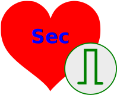  | Juan González |  Versión 0.1  |
| [Corazon-tic-ms](blocks/4-Secuenciales/3-Astables/Tics/04-Heart-ms.ice) | Corazón de bombeo de tics con un periodo paramétrico de milisegundos (por defecto 1 milisegundo) |     | Juan González |  Versión 0.1  |
| [Corazon-tic-us](blocks/4-Secuenciales/3-Astables/Tics/06-Heart-us.ice) | Corazón de bombeo de tics con un periodo paramétrico de microsegundos (por defecto 1 microsegundo) |     | Juan González |  Versión 0.1  |
| [Corazon-tic](blocks/4-Secuenciales/3-Astables/Tics/08-Heart-tics.ice) | Corazón de bombeo de tics, cuyo periodo está especificado en tics (por defecto 10 tics) |   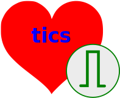    | Juan González |  Versión 0.1  |
| [Contador-2bits-up-rst-system](blocks/4-Secuenciales/2-Contadores/02-bits/cont-up-system.ice) | Contador del sistema, módulo M, ascendente, de 2 bits, con reset |       | Juan González |  Versión 0.1  |
| [Contador-2bits-up-rst](blocks/4-Secuenciales/2-Contadores/02-bits/cont-up.ice) | Contador de tics módulo M, ascendente, de 2 bits, con reset  |          | Juan González |  Versión 0.1  |
| [Contador-3bits-up-rst-system](blocks/4-Secuenciales/2-Contadores/03-bits/cont-up-system.ice) | Contador del sistema, módulo M, ascendente, de 3 bits, con reset |       | Juan González |  Versión 0.1  |
| [Contador-3bits-up-rst](blocks/4-Secuenciales/2-Contadores/03-bits/cont-up.ice) | Contador de tics módulo M, ascendente, de 3 bits, con reset  |          | Juan González |  Versión 0.1  |
| [Contador-4bits-up-rst-system](blocks/4-Secuenciales/2-Contadores/04-bits/cont-up-system.ice) | Contador del sistema, módulo M, ascendente, de 4 bits, con reset |       | Juan González |  Versión 0.1  |
| [Contador-4bits-up-rst](blocks/4-Secuenciales/2-Contadores/04-bits/cont-up.ice) | Contador de tics módulo M, ascendente, de 4 bits, con reset  |          | Juan González |  Versión 0.1  |
| [Contador-8bits-up-rst-system](blocks/4-Secuenciales/2-Contadores/08-bits/cont-up-system.ice) | Contador del sistema, módulo M, ascendente, de 8 bits, con reset |       | Juan González |  Versión 0.1  |
| [Contador-8bits-up-rst](blocks/4-Secuenciales/2-Contadores/08-bits/cont-up.ice) | Contador de tics módulo M, ascendente, de 8 bits, con reset  |          | Juan González |  Versión 0.1  |
| [Registro-PIPO-8Bits](blocks/4-Secuenciales/3-Registros/08-bits/1-RegParal.ice) |   Registro paralelo/paralelo de 8 bits, carga mediante tic   |           | Juan González |  Versión 0.1  |
| [Registro-SIPO/SISO-8Bits](blocks/4-Secuenciales/3-Registros/08-bits/2-Reg-SIPO.ice) | Registro serie/paralelo y serie/serie de 8 bits, desplazamiento de entrada a salida mediante tics |      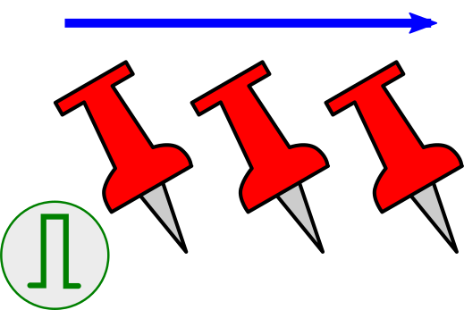      | Juan González |  Versión 0.1  |
| [Registro-Universal-8Bits](blocks/4-Secuenciales/3-Registros/08-bits/3-Reg-Univ.ice) | Registro universal serie paralelo de 8 bits, desplazamiento de entrada a salida mediante tics |            | Juan González |  Versión 0.1  |

### Periféricos

|                          Componente                          |                         Descripción                          |                             SVG                              |            Autor            |    Info     |
| :----------------------------------------------------------: | :----------------------------------------------------------: | :----------------------------------------------------------: | :-------------------------: | :---------: |
| [ServoBit-90-Tower-Pro-SG90](blocks/5-Perifericos/1-Servomotor/TowerPro-SG90/Servobit-90.ice) | ServoBit para micrservo TowerPro-SG90. Controlador de 1 bit para mover un servo a 2 posiciones. El ángulo entre una posición y otra es de 90 grados | 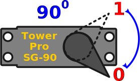 | Jesús Arroyo, Juan González | Versión 0.1 |
| [ServoBit-Tower-Pro-SG90](blocks/5-Perifericos/1-Servomotor/TowerPro-SG90/Servobit.ice) | ServoBit para micrservo TowerPro-SG90. Controlador de 1 bit para mover un servo a 2 posiciones. El ángulo entre una posición y otra la define el usuario |  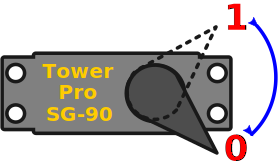   | Jesús Arroyo, Juan González | Versión 0.1 |
| [ServoPWM-8bits](blocks/5-Perifericos/1-Servomotor/ServoPWM-8bits.ice) | Controlador de servos de 8 bits, activado por tics y enable. El periodo del PWM por defecto es de 20ms (Futaba 3003) |       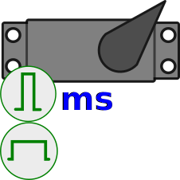       |        Juan González        | Versión 0.1 |
|   [Serial-TX](blocks/5-Perifericos/2-Serial/Serial-tx.ice)   | Transmisor de 8 bits serie asíncrono. Velocidad por defecto: 115200 baudios |                   |        Juan González        | Versión 0.2 |
|   [Serial-Rx](blocks/5-Perifericos/2-Serial/Serial-rx.ice)   | Receptor de 8 bits serie asíncrono. Velocidad por defecto: 115200 baudios |                   |        Juan González        | Versión 0.2 |
| [Sonido](https://groups.google.com/forum/#!msg/fpga-wars-explorando-el-lado-libre/5b0ULNjZZKA/QcV-lF0bCAAJ) |                                                              |                                                              |                             |             |
| [Motor PaP](https://github.com/Obijuan/escornabot-fpga/tree/master/Escornabot-collection/blocks/Varios/Stepper) |                                                              |                                                              |                             |             |
| [Motor PaP2](https://github.com/jospicant/IceStudio/tree/master/Ice40/Robot/Modules   ) |                                                              |                                                              |                             |             |

